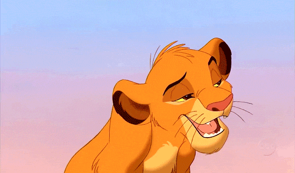

<!DOCTYPE html>
<html lang="en">
<head>
    <meta charset="UTF-8">
    <meta name="viewport" content="width=device-width, initial-scale=1.0">
    <title>Will You Be My Valentine?</title>
    <link href="https://fonts.googleapis.com/css2?family=Playfair+Display:wght@600&family=Quicksand:wght@500&display=swap" rel="stylesheet">
    
</head>
<body>
    

        

            
        

        <h1 id="mainQuestion">Will You Be My Valentine?</h1>
        
Yay omw to hug you! 🏃♀️💨

        

            <button class="btn" id="yesBtn">YES</button>
            <button class="btn" id="noBtn">NO</button>
        

        

    

    
</body>
</html>
